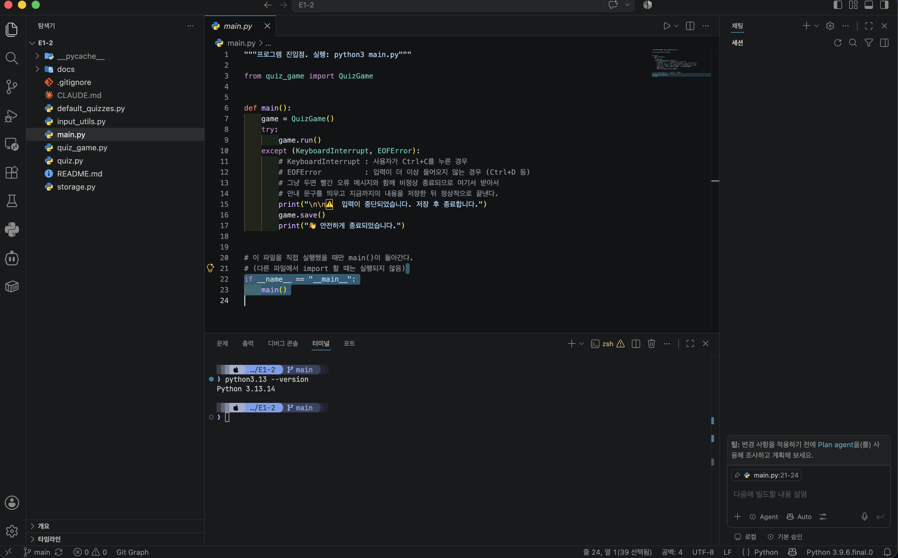
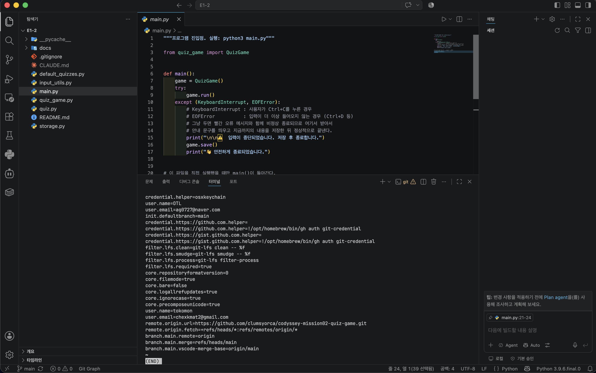
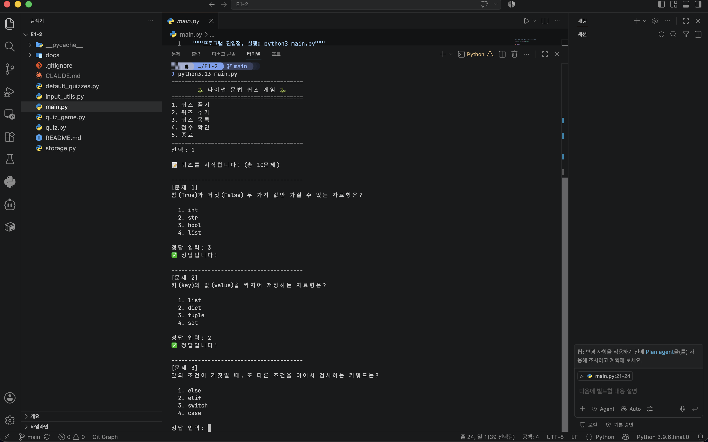
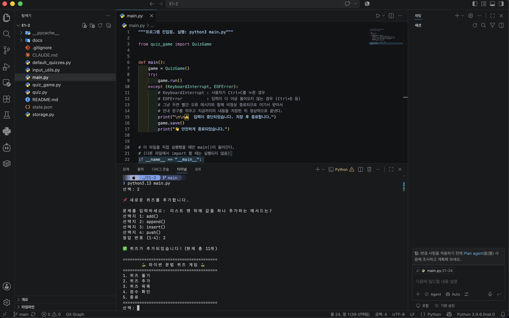
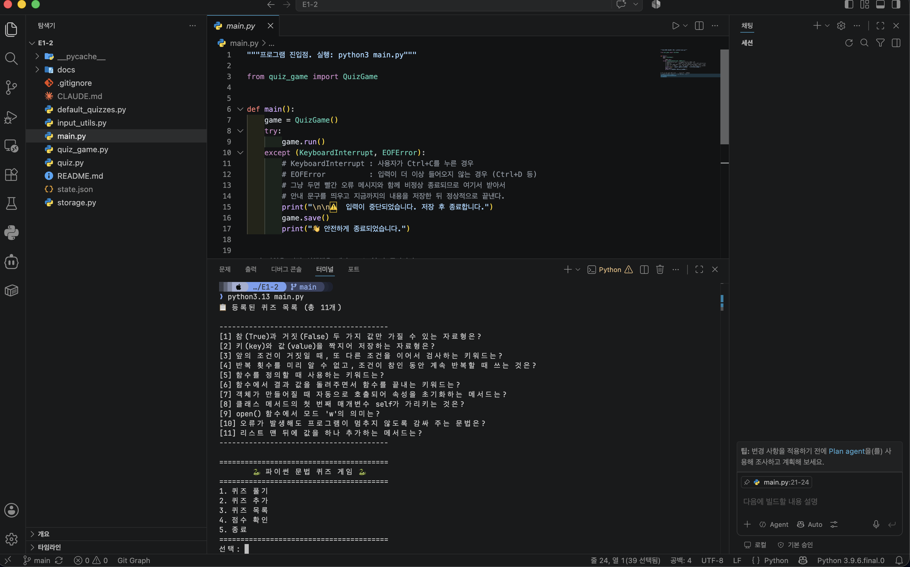
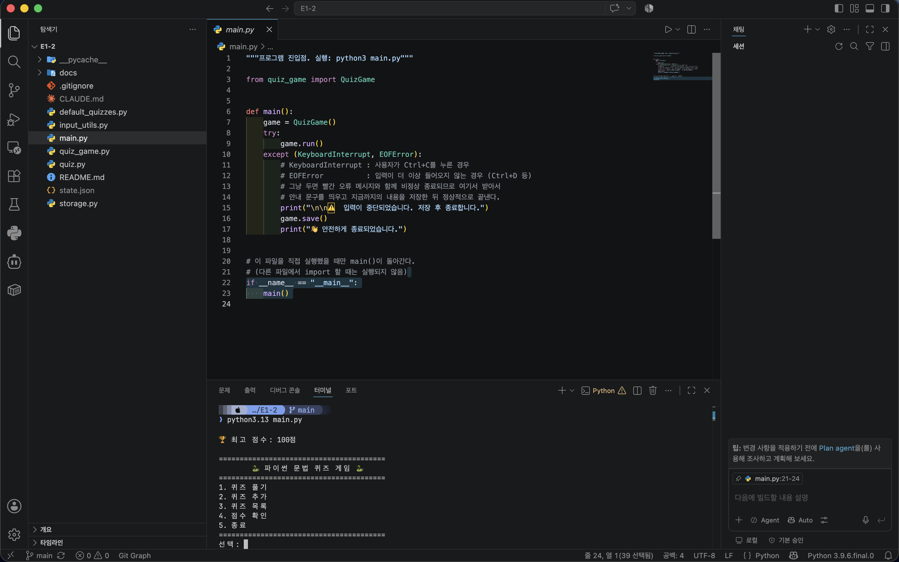
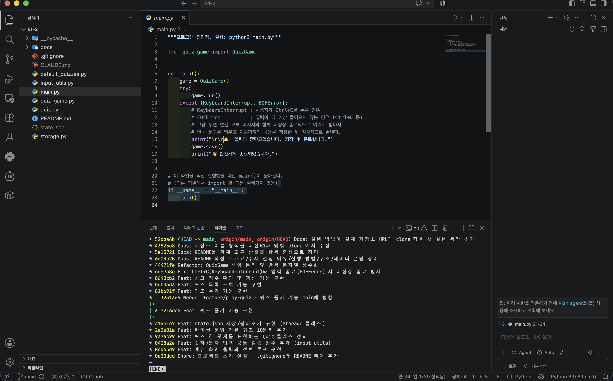

# 나만의 퀴즈 게임 — 파이썬 문법 퀴즈

터미널에서 동작하는 **파이썬 문법 4지선다 퀴즈 게임**입니다.

---

## 1. 프로젝트 개요

파이썬 기본 문법으로 입력 → 처리 → 출력 흐름을 만들고, 역할이 다른 일을 클래스로 나눈 뒤,
`state.json` 파일에 저장해서 **프로그램을 껐다 켜도 퀴즈와 최고 점수가 유지되는** 콘솔 프로그램입니다.

| 항목 | 값 |
|---|---|
| 프로그램 | 터미널 4지선다 퀴즈 게임 |
| 언어 / 버전 | Python **3.13.14** (3.10 이상 필요) |
| 외부 라이브러리 | **없음** — 표준 라이브러리(`json`, `os`)만 사용 |
| 데이터 저장 | 프로젝트 루트 `state.json` (UTF-8) |
| 클래스 | `Quiz`, `Storage`, `QuizGame` (3개) |
| 기본 문제 수 | 10문제 |

---

## 2. 퀴즈 주제와 선정 이유

**주제: 파이썬 문법**

3년 전에 파이썬을 공부했지만 오래 쓰지 않아 기억이 흐려진 상태였습니다.
그래서 이번 미션을 **"만들면서 동시에 복습하는" 도구**로 쓰기로 했습니다.

주제를 파이썬 문법으로 잡으니 세 가지가 한 번에 해결됐습니다.

1. **문제를 만들려면 먼저 내가 알아야 합니다.** 문제·선택지·정답을 직접 쓰는 과정 자체가 복습이었습니다.
   특히 헷갈렸던 `self`, `__init__`, `open()`의 모드 문자는 문제로 만들면서 정리됐습니다.
2. **기본 10문제를 이번 미션의 학습 목표에 맞춰 배치했습니다.**
   자료형(2) / 조건문(1) / 반복문(1) / 함수(2) / 클래스(2) / 파일 입출력(1) / 예외 처리(1) —
   즉 이 게임을 한 판 풀면 이번 과제의 핵심 문법을 한 바퀴 훑게 됩니다.
3. **만드는 코드와 문제의 내용이 같아서 서로 검증이 됩니다.**
   예를 들어 "`try/except`는 무엇인가"를 문제로 내면서, 실제로 `Storage.load()`에서
   `try/except`로 손상된 파일을 복구하는 코드를 짰습니다. 문제의 답이 곧 제 코드 안에 있습니다.

기본 문제 전체는 [`default_quizzes.py`](default_quizzes.py)에 있습니다.

---

## 3. 실행 방법

```bash
git clone https://github.com/clumsyorca/codyssey-mission02-quiz-game.git
cd codyssey-mission02-quiz-game

python3.13 main.py
```

`python3`가 이미 3.10 이상이면 `python3 main.py`로도 실행됩니다.

`clone` 직후에는 `state.json`이 없으므로 기본 퀴즈 10문제로 시작합니다.

```
📂 저장된 데이터가 없어 기본 퀴즈로 시작합니다. (state.json 없음)
```

```bash
$ python3.13 --version
Python 3.13.14
```

> **3.10 이상이 필요한 이유**: 메뉴 분기에 파이썬 3.10에서 추가된 `match/case` 문법을 사용합니다.
> 3.9 이하에서 실행하면 `SyntaxError`가 발생합니다.

설치가 필요하면 (macOS + Homebrew 기준):

```bash
brew install python@3.13
```

---

## 4. 기능 목록

| 번호 | 기능 | 하는 일 | 담당 메서드 |
|---|---|---|---|
| 1 | 퀴즈 풀기 | 등록된 문제를 순서대로 출제 → 채점 → 100점 만점 결과 표시, 최고 점수 갱신 | `QuizGame.play_quiz()` |
| 2 | 퀴즈 추가 | 문제 + 선택지 4개 + 정답 번호를 입력받아 등록하고 즉시 파일에 저장 | `QuizGame.add_quiz()` |
| 3 | 퀴즈 목록 | 등록된 문제를 번호와 함께 나열 (정답은 노출하지 않음) | `QuizGame.show_quiz_list()` |
| 4 | 점수 확인 | 저장된 최고 점수 확인, 기록이 없으면 안내 | `QuizGame.show_score()` |
| 5 | 종료 | 현재 상태를 저장하고 프로그램 종료 | `QuizGame.run()` |

### 잘못된 입력 처리

숫자를 받는 모든 곳(메뉴 선택, 정답 입력, 정답 번호)은 `input_utils.ask_number()` 하나를 사용합니다.

| 상황 | 입력 예 | 동작 |
|---|---|---|
| 앞뒤 공백 | `"  1  "` | `.strip()` 후 `1`로 정상 처리 |
| 숫자가 아님 | `abc` | 안내 후 재입력 |
| 범위 밖 | `9`, `0` | 안내 후 재입력 |
| 빈 입력 | (그냥 Enter) | 안내 후 재입력 |
| Ctrl+C / 입력 종료 | `KeyboardInterrupt`, `EOFError` | 안내 후 **저장하고** 정상 종료 |
| 데이터 파일 없음 / 손상 | — | 안내 후 기본 퀴즈 10문제로 시작 |
| 퀴즈 0개인데 풀기 시도 | — | 안내 후 메뉴로 복귀 |

### 실행 화면

**메뉴**

```
========================================
        🐍 파이썬 문법 퀴즈 게임 🐍
========================================
1. 퀴즈 풀기
2. 퀴즈 추가
3. 퀴즈 목록
4. 점수 확인
5. 종료
========================================
선택:
```

**퀴즈 풀기**

```
선택: 1

📝 퀴즈를 시작합니다! (총 10문제)

----------------------------------------
[문제 1]
참(True)과 거짓(False) 두 가지 값만 가질 수 있는 자료형은?

  1. int
  2. str
  3. bool
  4. list

정답 입력: 3
✅ 정답입니다!

----------------------------------------
[문제 2]
키(key)와 값(value)을 짝지어 저장하는 자료형은?

  1. list
  2. dict
  3. tuple
  4. set

정답 입력: 1
❌ 오답입니다. 정답은 2번 (dict) 입니다.

... (중략) ...

========================================
🏆 결과: 10문제 중 8문제 정답! (80점)
🎉 새로운 최고 점수입니다!
========================================
```

**퀴즈 추가**

```
선택: 2

📌 새로운 퀴즈를 추가합니다.

문제를 입력하세요: 리스트를 만들 때 사용하는 괄호는?
선택지 1: 소괄호 ()
선택지 2: 대괄호 []
선택지 3: 중괄호 {}
선택지 4: 꺾쇠 <>
정답 번호 (1-4): 2

✅ 퀴즈가 추가되었습니다! (현재 총 11개)
```

**퀴즈 목록 / 점수 확인**

```
선택: 3

📋 등록된 퀴즈 목록 (총 11개)

----------------------------------------
[1] 참(True)과 거짓(False) 두 가지 값만 가질 수 있는 자료형은?
[2] 키(key)와 값(value)을 짝지어 저장하는 자료형은?
...
[11] 리스트를 만들 때 사용하는 괄호는?
----------------------------------------

선택: 4

🏆 최고 점수: 80점
```

**잘못된 입력**

```
선택: abc
⚠️  숫자만 입력할 수 있습니다. 1-5 사이의 숫자를 입력하세요.
선택: 9
⚠️  1-5 범위를 벗어났습니다. 다시 입력하세요.
```

**재실행 후 데이터 유지**

```bash
$ python3.13 main.py
📂 저장된 데이터를 불러왔습니다. (퀴즈 11개, 최고점수 80점)
```

---

## 5. 파일 구조

```
E1-2/
├── main.py              # 진입점 — 게임 실행 + Ctrl+C/EOF 안전 종료 처리
├── quiz.py              # Quiz 클래스 — 문제 1개를 표현
├── quiz_game.py         # QuizGame 클래스 — 메뉴/게임 진행 전체 관리
├── storage.py           # Storage 클래스 — state.json 읽기/쓰기
├── input_utils.py       # 입력 검증 공통 함수 (ask_number / ask_text)
├── default_quizzes.py   # 기본 파이썬 문법 퀴즈 10문제
├── state.json           # (실행하면 생성) 퀴즈 목록 + 최고 점수 — .gitignore 처리
├── .gitignore
├── README.md            # 이 문서
└── docs/
    └── screenshots/     # 실행 화면 / 개발 환경 / git log 캡처
```

**구성 기준**: ① **파일 하나 = 역할 하나**로 나눴습니다. "문제를 표현하는 일"(`quiz.py`),
"파일을 다루는 일"(`storage.py`), "게임을 진행하는 일"(`quiz_game.py`)은 성격이 다른 작업이라
한 파일에 섞으면 한 곳을 고칠 때 다른 곳이 함께 흔들립니다.
② 입력 검사는 메뉴·정답·퀴즈 추가 등 여러 곳에서 똑같이 반복되므로 `input_utils.py`로 빼서
한 번만 고치면 전부 적용되게 했습니다.
③ 기본 데이터(`default_quizzes.py`)는 코드가 아니라 **내용물**이므로 로직과 분리했습니다.

### 클래스 구성

| 클래스 | 파일 | 책임 | 주요 속성 | 주요 메서드 |
|---|---|---|---|---|
| `Quiz` | `quiz.py` | 문제 **1개**를 표현하고 채점 | `question`, `choices`, `answer` | `show()`, `is_correct()`, `to_dict()`, `from_dict()` |
| `Storage` | `storage.py` | `state.json` 읽기/쓰기와 복구 | `path` | `load()`, `save()` |
| `QuizGame` | `quiz_game.py` | 메뉴 진행과 전체 흐름 관리 | `quizzes`, `best_score`, `storage` | `run()`, `play_quiz()`, `add_quiz()`, `show_quiz_list()`, `show_score()` |

`QuizGame`은 "JSON으로 저장한다"는 사실을 몰라도 되고(`self.storage.save(...)`만 호출),
`Storage`는 게임 규칙을 몰라도 됩니다. 저장 방식을 파일에서 DB로 바꿔도 `storage.py`만 고치면 됩니다.

### 클래스를 3개로 나눈 기준

**"바뀌는 이유가 다르면 나눈다"**를 기준으로 삼았습니다.

- 문제의 생김새가 바뀌면 → `Quiz`만 고침
- 저장 방식이 바뀌면 → `Storage`만 고침
- 게임 진행 순서가 바뀌면 → `QuizGame`만 고침

한 파일에 다 넣으면 한 곳을 고칠 때 나머지가 같이 흔들립니다.

### 무엇을 함수로 하고 무엇을 클래스로 했나

| 기준 | 함수로 | 클래스로 |
|---|---|---|
| **기억할 값이 있는가** | 없음 — 받아서 검사하고 돌려주면 끝 | 있음 — 퀴즈 목록, 최고 점수를 계속 들고 있어야 함 |
| 해당하는 것 | `ask_number()`, `ask_text()` | `Quiz`, `Storage`, `QuizGame` |

입력 검증은 메뉴·정답·정답 번호 **세 곳에서 똑같이 반복**되지만 기억할 상태가 없어서 함수로 뺐습니다.
반대로 `QuizGame`은 `self.quizzes`와 `self.best_score`를 계속 들고 있어야 해서 클래스입니다.

### 함수만으로 만들었다면 무엇이 달랐을까

함수만으로도 만들 수 있습니다. 퀴즈를 `dict`로 두고 `check_answer(quiz_dict, user_input)` 같은
함수를 만들면 됩니다. 클래스를 쓴 이유는 세 가지입니다.

| | 함수만 사용 | 클래스 사용 |
|---|---|---|
| 채점 호출 | `check_answer(quiz, 3)` | `quiz.is_correct(3)` — **문제가 스스로 채점** |
| 형식 오류 | `quesiton`처럼 오타를 내도 그냥 넘어감 | `Quiz.from_dict()`가 `ValueError`로 걸러냄 |
| 상태 관리 | 퀴즈 목록·점수를 전역 변수로 들고 다녀야 함 | `self`에 담겨 섞이지 않음 |

---

## 6. 데이터 파일 설명 — `state.json`

| 항목 | 내용 |
|---|---|
| 경로 | 프로젝트 루트 `./state.json` (`storage.py` 위치 기준 절대 경로로 계산) |
| 인코딩 | UTF-8 (`ensure_ascii=False`로 한글을 그대로 저장) |
| 역할 | 등록된 퀴즈 전체와 최고 점수를 보관 → 프로그램을 껐다 켜도 유지 |
| 생성 시점 | 첫 실행 후 저장이 일어날 때 자동 생성 |
| Git 추적 | **제외**(`.gitignore`) — 실행하면 생기는 데이터라서 |

### 스키마

```json
{
  "quizzes": [
    {
      "question": "참(True)과 거짓(False) 두 가지 값만 가질 수 있는 자료형은?",
      "choices": ["int", "str", "bool", "list"],
      "answer": 3
    }
  ],
  "best_score": 80
}
```

| 필드 | 타입 | 설명 |
|---|---|---|
| `quizzes` | list | 퀴즈 목록 |
| `quizzes[].question` | str | 문제 내용 (빈 문자열 불가) |
| `quizzes[].choices` | list[str] | 선택지 **정확히 4개** |
| `quizzes[].answer` | int | 정답 번호 **1~4** (0부터 세지 않음 — 화면 번호와 일치) |
| `best_score` | int | 최고 점수 (100점 만점 환산) |

### 왜 JSON인가

- 파이썬의 `dict` / `list`와 구조가 거의 1:1이라 **변환이 자연스럽습니다.**
- 텍스트라서 **사람이 열어서 읽을 수 있습니다.**
- 파이썬이 아닌 다른 언어에서도 읽을 수 있습니다.

**단, JSON이 저장할 수 있는 것은 dict / list / 문자열 / 숫자 / 참거짓 / null뿐입니다.**
`Quiz` 객체는 저장하지 못합니다. 그래서 `to_dict()`로 dict로 번역해 저장하고,
불러올 때 `from_dict()`로 다시 객체로 되돌립니다.

한글이 `\uXXXX`로 깨지지 않도록 `ensure_ascii=False`와 `encoding="utf-8"`을 함께 지정했습니다.

### 이 구조를 택한 이유

```
{                            ← ① 전체를 dict로 감쌈
  "quizzes": [               ← ② 문제들의 목록 (list)
    { "question": "...",     ← ③ 문제 하나 (dict)
      "choices": ["a","b"],  ← ④ 선택지 목록 (list)
      "answer": 3 }
  ],
  "best_score": 80
}
```

- **① 최상위를 list가 아닌 dict로** — 나중에 필드를 추가할 자리가 생깁니다. list였다면 확장할 곳이 없습니다.
- **② `quizzes`를 list로** — 리스트 순서가 곧 출제 순서입니다.
- **④ `choices`도 list로** — 순서가 곧 화면의 1번·2번 번호입니다.
- **정답을 텍스트가 아니라 번호(int)로** — `"bool"`처럼 문자열로 저장하면 선택지를 수정했을 때
  정답이 어긋납니다. 번호로 두면 사용자가 입력한 값과 그대로 비교됩니다.
- **깊이는 4단계로 얕게** — 더 깊어지면 값을 꺼낼 때 `data["a"]["b"]["c"]["d"]`처럼 길어지고
  검증 코드도 복잡해집니다.

### 언제 읽고 언제 쓰는가

**읽기는 프로그램 시작 시 딱 한 번입니다.**

```
main() → QuizGame() 생성 → __init__ → Storage.load()
```

이후에는 파일을 다시 읽지 않고 메모리의 `self.quizzes` 리스트로만 작업합니다.

**쓰기는 "잃으면 안 되는 것이 생긴 시점"마다 일어납니다.**

| 시점 | 위치 |
|---|---|
| 퀴즈를 추가한 직후 | `QuizGame.add_quiz()` |
| 최고 점수가 갱신될 때 | `QuizGame.update_best_score()` |
| 메뉴 5번으로 종료할 때 | `QuizGame.run()` |
| Ctrl+C / EOF로 중단될 때 | `main()`의 `except` |

퀴즈를 추가하고 저장을 미뤘다가 프로그램이 갑자기 꺼지면 그 문제가 사라지므로,
추가 직후 바로 저장합니다.

### 읽기 실패 시 동작

파일이 없거나 내용이 깨져 있어도 프로그램은 종료되지 않고 기본 퀴즈로 시작합니다.

| 상황 | 잡는 예외 | 처리 |
|---|---|---|
| 파일 없음 (첫 실행) | — (`os.path.exists`로 확인) | 기본 퀴즈 10문제로 시작 |
| JSON 형식이 아님 | `json.JSONDecodeError` | 안내 후 기본 퀴즈로 복구 |
| 필요한 키가 없음 | `KeyError` | 안내 후 기본 퀴즈로 복구 |
| 선택지 개수·정답 범위가 어긋남 | `ValueError` | 안내 후 기본 퀴즈로 복구 |
| 값의 타입이 예상과 다름 | `TypeError` | 안내 후 기본 퀴즈로 복구 |
| 권한 문제 등으로 못 읽음/못 씀 | `OSError` | 안내 후 기본값 사용 |

```bash
# 첫 실행 (파일 없음)
$ python3.13 main.py
📂 저장된 데이터가 없어 기본 퀴즈로 시작합니다. (state.json 없음)

# 파일이 깨진 경우
$ echo '{ 깨진내용' > state.json
$ python3.13 main.py
⚠️  데이터 파일이 손상되어 기본 퀴즈로 복구합니다.
   (원인: Expecting property name enclosed in double quotes: line 1 column 3 (char 2))
```

### 왜 `try/except`가 필요한가

파일은 **내 코드 바깥의 세상**입니다. 코드가 완벽해도 아래 상황은 언제든 일어납니다.

- 파일이 아직 없음 (첫 실행)
- 사용자가 파일을 열어 편집하다가 형식을 깨뜨림
- 편집 중 키를 지워서 `quizzes` 키가 사라짐
- 선택지를 3개만 남기거나 정답을 `5`로 적음
- 권한이나 디스크 문제로 읽기·쓰기 자체가 실패

`except:` 하나로 모두 잡지 않고 `json.JSONDecodeError`, `KeyError`, `ValueError`, `OSError`로
**원인별로 나눠 잡았습니다.** 무엇이 잘못됐는지 알아야 안내 메시지도 달라질 수 있기 때문입니다.

예외 처리는 오류를 숨기는 것이 아니라 **프로그램이 어떻게 끝날지 직접 정하는 것**입니다.
같은 이유로 Ctrl+C(`KeyboardInterrupt`)와 입력 종료(`EOFError`)도 `main()`에서 잡아
안내 → 저장 → 정상 종료(코드 0) 순서로 처리합니다. 예외는 위로 전파되므로
`input()`이 있는 모든 곳이 아니라 **가장 바깥 한 곳에서만** 잡으면 됩니다.

### `state.json`을 커밋하지 않는 이유

`state.json`은 소스 코드가 아니라 **실행 결과로 쌓이는 데이터**입니다.
커밋하면 게임을 한 판 풀 때마다 점수가 바뀌어 매번 변경 사항으로 잡히고,
여러 사람이 각자 다른 점수로 커밋하면 충돌만 납니다.
대신 파일이 없어도 정상 동작하도록 만들었기 때문에, `clone` 직후 첫 실행은 기본 10문제로 시작합니다.

---

## 7. 요구사항이 바뀌면 어디를 고치나

| 바뀌는 것 | 먼저 고칠 곳 |
|---|---|
| 점수 계산 방식 | `quiz_game.py` → `show_result()`의 점수 계산 **한 줄** |
| 최고 점수 판단 기준 | `quiz_game.py` → `update_best_score()` |
| 선택지 개수 (4개 → 5개) | `quiz.py` → `CHOICE_COUNT` **상수 하나** (+ 기존 데이터 마이그레이션 필요) |
| 저장 방식 (JSON → DB) | `storage.py` **only** — `QuizGame`은 손대지 않음 |
| 문제 출제 순서·개수 | `quiz_game.py` → `play_quiz()` |

선택지 개수를 쓰는 곳은 세 군데(`from_dict()` 검증, `add_quiz()` 입력 루프, 정답 입력 범위)인데
전부 숫자 `4`를 직접 쓰지 않고 `CHOICE_COUNT` 상수를 참조합니다.
다만 **코드만 바꾸면 끝나지 않습니다.** 이미 저장된 문제들은 선택지가 4개라 검증에 걸리므로
기존 데이터를 옮기는 작업이 함께 필요합니다.

---

## 8. Git 작업 기록

### 커밋을 나눈 단위와 메시지 규칙

**"이 시점에서 프로그램이 실행되는가"**를 기준으로 잘랐습니다.
기능을 완성해 직접 실행해 본 뒤 커밋했기 때문에 어느 커밋으로 되돌려도 실행됩니다.

| 접두어 | 의미 | 예 |
|---|---|---|
| `Feat` | 새 기능 | `Feat: 퀴즈 풀기 기능 구현` |
| `Fix` | 버그 수정 | `Fix: Ctrl+C 입력 종료 시 비정상 종료 방지` |
| `Refactor` | 동작 변화 없는 정리 | `Refactor: QuizGame 책임 분리` |
| `Docs` | 문서 | `Docs: README 작성` |
| `Chore` | 설정 | `Chore: 프로젝트 초기 설정` |

제목만 쓰지 않고 **본문에 무엇을 왜 바꿨는지** 함께 적었습니다.

### 브랜치를 나눈 이유와 병합

```bash
git checkout -b feature/play-quiz     # 브랜치 생성 + 이동
git commit -m "Feat: 퀴즈 풀기 기능 구현"
git checkout main                     # main으로 복귀
git merge --no-ff feature/play-quiz   # 병합
git branch -d feature/play-quiz       # 정리
```

기능 하나를 만드는 동안에는 **코드가 반쯤 만들어진 상태**로 있게 됩니다.
호출하는 함수가 아직 없거나 안이 비어 있어 실행하면 오류가 나는 시간이 생깁니다.
그 미완성 상태를 `main`에 두면 그동안 `main`이 실행되지 않는 저장소가 되므로,
퀴즈 풀기처럼 핵심 기능은 별도 브랜치에서 완성한 뒤 합쳤습니다.

**병합(merge)** 은 갈라져 있던 두 갈래의 작업을 하나로 합치는 것입니다.
`--no-ff`를 쓴 이유는, 그냥 병합하면 커밋이 일렬로 붙어 **브랜치를 썼다는 흔적이 사라지기** 때문입니다.
`--no-ff`는 병합 커밋을 따로 만들어 `git log --graph`에 갈래를 남깁니다.

### clone / pull 실습

원격 저장소가 있을 때 여러 사람(또는 여러 PC)이 같은 코드를 주고받는 과정을 확인한 실습입니다.

```bash
# 1) 별도 디렉터리에 복제 — 다른 PC에서 내려받은 상황
$ cd ~/Documents/codyssey
$ git clone https://github.com/clumsyorca/codyssey-mission02-quiz-game.git E1-2-clone
Cloning into 'E1-2-clone'...

# 복제 직후 실행하면 state.json이 없으므로 기본 퀴즈로 시작
$ python3.13 E1-2-clone/main.py
📂 저장된 데이터가 없어 기본 퀴즈로 시작합니다. (state.json 없음)

# 2) 복제본에서 README를 수정하고 원격에 올림
$ cd E1-2-clone
$ git add README.md
$ git commit -m "Docs: 실행 방법에 실제 저장소 URL과 clone 직후 첫 실행 동작 추가"
$ git push
   43825c8..52cbe6b  main -> main

# 3) 원래 작업 폴더에서 변경사항을 받아옴
$ cd ../E1-2
$ git pull
Updating 43825c8..52cbe6b
Fast-forward
 README.md | 8 +++++++-
 1 file changed, 7 insertions(+), 1 deletion(-)

# 4) 반영 확인
$ git log --oneline -1
52cbe6b Docs: 실행 방법에 실제 저장소 URL과 clone 직후 첫 실행 동작 추가
```

이때 복제본에서 고친 내용은 위 [3. 실행 방법](#3-실행-방법)의 저장소 주소와
`clone` 직후 첫 실행 동작 설명입니다. 커밋 `52cbe6b`이 그 결과물입니다.

### Git 명령어 7종 사용 위치

| 명령어 | 사용한 곳 |
|---|---|
| `init` | 프로젝트 시작 시 로컬 저장소 생성 (`git init -b main`) |
| `add` | 매 커밋 전 변경 파일 스테이징 |
| `commit` | 기능 단위 커밋 |
| `push` | GitHub 원격 저장소로 업로드 |
| `pull` | 복제본의 변경사항을 원래 작업 폴더로 수신 |
| `checkout` | `feature/play-quiz` 생성·이동, `main` 복귀 |
| `clone` | 원격 저장소를 `E1-2-clone`으로 복제 |

---

## 9. 실행 화면 스크린샷

### 개발 환경

Python 버전 확인 — `python3.13 --version` → `Python 3.13.14`



Git 설정 확인 — `git config --list` (사용자 정보, 기본 브랜치 main, 원격 저장소 URL)



### 프로그램 실행

메뉴 화면과 퀴즈 풀기 — 문제 출제, 정답 입력, 정답/오답 판정



퀴즈 추가 — 문제·선택지 4개·정답 번호를 입력받아 등록 (총 11개로 증가)



퀴즈 목록 — 등록된 11문제



점수 확인 — 저장된 최고 점수



### 커밋 이력

`git log --oneline --graph` — `feature/play-quiz` 브랜치가 갈라졌다 병합된 부분이 보입니다.


